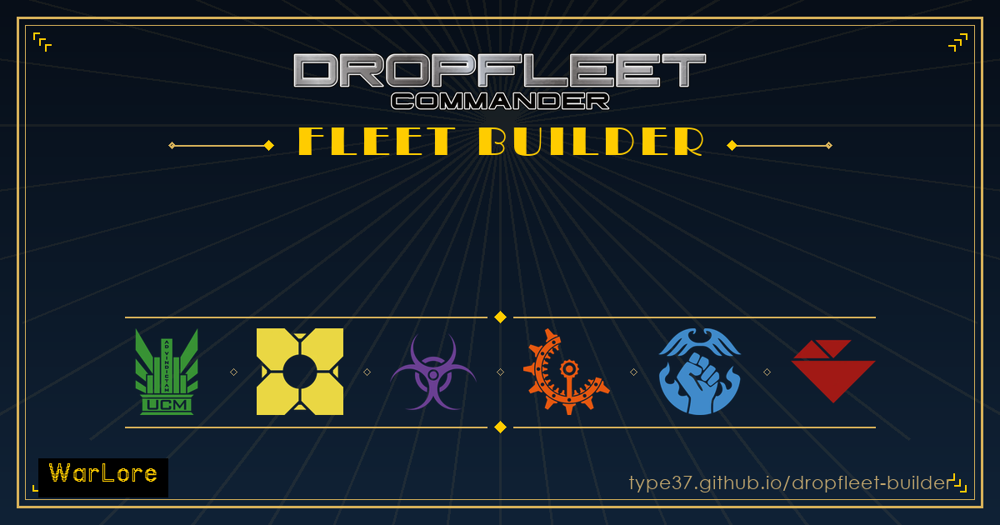

<div align="center">

[](https://type37.github.io/dropfleet-builder/)

# Dropfleet Commander Fleet Builder

A free fleet builder for [Dropfleet Commander](https://www.ttcombat.com/games/dropfleet-commander). No login, no install. Fleets save in your browser and work offline.

### ▶ [Desktop](https://type37.github.io/dropfleet-builder/) &nbsp;&nbsp;&nbsp; 📱 [Mobile](https://type37.github.io/dropfleet-builder/mobile/)

*Phones open the mobile version. Both share the same saved fleets.*

</div>

## Features

All six factions: UCM, PHR, Scourge, Shaltari, Resistance, Bioficers.

- Full stats, weapons, launch assets and special rules for every ship, with the rulebook text for any keyword one tap away.
- Generic and famous admirals (famous ones bring their flagship).
- Every game size from Skirmish to Reconquest, with group, Colossal and admiral limits enforced.
- Resistance modular ships: Systems/Hardpoint pickers, Feature Carriers and loadout refits, folded into the fielded stats.
- Live validation: points, group caps, Unique/Rare, required systems, Porter and Payload capacity.
- Space stations, secondary objectives, ship art and per-class lore.
- Print sheets, share links and New Recruit export.
- Combat calculator with exact damage odds.

## Mobile

The [mobile build](https://type37.github.io/dropfleet-builder/mobile/) is built for touch and shares storage with the desktop site. Copy-as-text, PDF export and one-tap Fast Play sheets. Add it to your home screen to run offline.

## Data

Stats come from the [BSData project](https://github.com/BSData/dropfleet-commander), converted to JSON and checked against the official Combined Fleet Stats PDFs. Ship art is TTCombat's. None of it is mine; it belongs to TTCombat.

## Running it

Plain HTML, CSS and JavaScript. No framework, no build step. Open `index.html`, or:

```sh
npx serve .
```

Fonts: [Jost](https://fonts.google.com/specimen/Jost), [Libre Baskerville](https://fonts.google.com/specimen/Libre+Baskerville), [Roboto Slab](https://fonts.google.com/specimen/Roboto+Slab), [Barlow Condensed](https://fonts.google.com/specimen/Barlow+Condensed).

## Changelog

Mirrors the in-app "What's New". TTCombat publishes no official changelog, so dated edition notes are the maintainer's interpretation.

### 2026-08-11: Mobile: Torpedoes and Boarding Pods are separate again

Mobile's `LAUNCH_TYPE_DEFS` was an older 5-bucket version of desktop's 9-type table, and one bucket matched `/torpedo|boarding\s*pod/` under a single "Torpedoes / Boarding Pods" label. Torpedoes attack and are removed after attacking; Boarding Pods board Space Stations and enemy Ships. Running the mobile logic over all six factions, 67 ships with launch chips read wrongly: 18 carry only Boarding Pods (Thebes, Delhi, Ebisu Tackling Cutter, Hiruko Boarding Cutter, Matrix Monitor, Source Battlecruiser, plus the Pungari Thresher Hive Ship and DH-Type Penal Transport in every faction) yet appeared to carry torpedoes, 43 carry only torpedoes and appeared able to board, and 6 Bioficer ships that carry both had them collapsed into one chip. The same bucketing merged Fighters with Bombers and Dropships with Drop Pods and Bulk Landers. Ported desktop's 9-type table across; verified by executing the edited `shipLaunchIcons` against all faction JSON (167 ships with launch chips, 0 merged labels remaining).

Mobile was also missing desktop's `hasBaseLaunches` guard, so a ship with fixed launches picked up launch types from its optional systems list. The Zenith and Zodiac Dreadnoughts therefore claimed a Torpedo launch that only comes from an optional Dreadnought Systems pick.

Icons: Bombardment was a circle with four ticks, near-identical to the "Other launch asset" glyph at 13px, now Phosphor `meteor`; Group size was two dots that read as an ellipsis, now Phosphor `circles-three`; Fire Ships was a teardrop blob, now Phosphor `fire-simple`. Phosphor is MIT and the paths are inlined, not CDN-loaded. Mobile's footer also gained the Dropzone builder link desktop already had.

### 2026-08-02: Fewer ships wrongly offering a Deployable Feature

`isFeatureCarrier()` matched any ship whose rules mentioned "Feature Carrier" or "Deployable Feature" by name, so ships that always carry one fixed feature (the M-Type Barge's Military Outpost, already a Load; the EX-7 Packet Runner's single Hangar Feature) wrongly got a picker offering unrelated faction features (e.g. Bioficer's Gravitational Arc/Ghost Orb Tower). Mobile also had a stray "any Porter S ship" fallback meant for the Genitor Tower that desktop never had, which alone put the picker on every Bioficer Porter S ship (16 of them). Both apps now require the rules to actually say "choose ... Deployable Feature(s)" before showing the picker; verified against every faction's PDF-sourced Feature Carrier text.

### 2026-08-01: Resistance 260731 edition, plus the Nefertem and the M.A.B. 67

The monthly TTCombat downloads scan found four updated files. PHR was already at 260626, so three needed work.

**Resistance, 260327 to 260731.** Ten new ships: Secutor (142) and Retiarius (134) Grand Cruisers; Trafalgar (122), Jutland (144) and Midway (160) Supercruisers; Xerxes (175), Darius (180) and Cyrus (185) Battlecruisers; Actium (180) and Salamis (200) Battle Carriers. Three new Deployable Features (ICBM Silo, Ark Lander, Scanner Dome, the faction's first) and a Bombardment Torpedo launch asset. Existing ships: Phalanx 165 to 185 with its N-31 Hybrid Gun Long Battery split into a Half and a Full Battery; Senator 145 to 155, its Missile Salvo replaced by a Missile Turret Pair plus a smaller Salvo, VX Bomb text now worded around Cities, "Swacs" respelled SWACS; Tribune 210 to 205, which drops Hagen's flagship to 250 (45 + 205); Centurion's N-31 Hybrid Gun Battery becomes a Full Battery (Att 8 to 6, gains Critical-1 and Fusillade-2) and both it and the Gladiator gain a Drive Refit option (+25 pts, +3" Thrust). The Senator and Xerxes Special column reads only Vanguard-3" in the PDF, so SWACS is carried as a named rule rather than in stats.special, correcting the older data.

**List-building enforcement.** The Cyrus is Rare, which `validateFleet` already scales by game size, verified by building two Cyrus groups at Skirmish and confirming "Cyrus Battlecruiser is Rare, max 1 group at Skirmish", then confirming a one-Cyrus list passes. The Actium and Salamis "choose two Deployable Features ... (duplicates are allowed)", which the single-slot picker could not express: `featureSlots` on the ship data now drives one picker per slot in both apps, stored as `feature` and `feature2` so old saves and shared links still load, and carried through share links, group collapsing, the overview, print and the text export. The Centurion's Remnant rule (usable in UCM and PHR fleets, Rare there) was already enforced in the data but its text was never shown; it is now on the ship card in all three factions. Feature launch bays render too, so the ICBM Silo shows Launch 2 Bombardment Torpedo, Limited-6.

**Shaltari, 260327 to 260731.** One addition: Nefertem of the Dawn in the Invisible Night, 81 pts, heavy destroyer, Cloak-2, Hero, Shield-5+, Stealth, Unique, armed with a Microwave Crescent. Modelled as a Hero group ship like Avram Bei, so no Admiral can be assigned to it.

**Civilian Ships & Scenarios, 260701 to 260801.** One addition: the M.A.B. 67 Fuel Transport, 55 pts, Mercenary, so it is available to every fleet. Carries the Fuel Transporter rule (granting the 2AP Fully Fuelled Ability), Ignite Reserves and Vectored. Boardable and Civilian Transport stay stripped per the v344 removal.

Art cut for all twelve new ships, thumbnails and the offline manifest regenerated, and the special-rule and named-rule audits repointed at the new editions and rerun clean.

### 2026-07-31 — The Admiral warning waits until a third of the points are spent
"Fleet must contain an Admiral" fired the moment the first ship landed, so an almost empty list opened with a red error you could do nothing useful about yet. Most people pick ships first and settle the admiral once the shape of the list is clear.

The check now waits until the fleet is at or past a third of its points limit (`maxPts / 3`, or a third of the bracket minimum for open-ended Reconquest, where the max is the 99999 sentinel). Same rule in `validateFleet` in both apps, using each one's existing custom-limit-aware total, so a custom cap scales the threshold with it. Nothing else about the check changed: it is still an error, and it still appears well before the list is legal.

### 2026-07-29 — Fleet Sync stays in step without polling
A device synced on app start and after its own edits, which left the obvious gap: a phone sitting open while you edit on the desktop had no reason to look again, so it quietly showed a stale list.

Closed with events rather than a timer. Polling would spend the free tier's daily reads doing nothing and keep a phone's radio awake at a table. Three listeners in `fleet-sync.js` cover what actually happens: `visibilitychange` (switching back to the app, the big one on a phone), `focus` (same idea for a background desktop tab), and `online` (signal returning, the games-hall case). All three go through the same `MIN_AUTO_GAP` floor, so flicking between apps cannot become a burst of writes.

Verified end to end: with the app open, the cloud copy was edited from outside, and returning to the app pulled the change and re-rendered the list. Tests now 41, including that ten rapid app switches produce exactly one write and that nothing fires when the user never opted in.

### 2026-07-29 — Fleet Sync: two visual bugs found in a real two-device test
Both were invisible to the automated tests, which drove `#confirm-action` programmatically and so never looked at the screen.

- **The confirmation dialog rendered BEHIND the sync modal.** Every `.modal-overlay` shares `--z-overlay`, so stacking fell to DOM order, and `#modal-sync` is declared after `#modal-confirm` in index.html. Pressing Confirm appeared to do nothing. Fixed by giving `#modal-confirm` `--z-overlay + 50`: a confirmation must always sit above whatever asked for it, not just above this one modal.
- **The confirm button said "Delete", in red.** `#modal-confirm` began as the delete confirmer with a hardcoded danger button, so reusing it asked "Combine these fleets?" and offered a red **Delete**. `confirmAction()` now takes `{ label, danger }`; defaults are unchanged so all existing delete callers behave exactly as before.

Verified across two genuinely isolated storages (separate browsers and origins, throwaway data): join merged 2+1=3, the reverse pull worked, and a delete on one device did NOT come back as a zombie on the other. Confirmed the deployed site reaches Firestore, that `/sync` is still not enumerable (403), and that the 22 real fleets on the live site were never touched.

### 2026-07-29 — Fleet Sync: opt-in cross-device sync
User-facing: **Sync Fleets Online** (desktop Settings, mobile menu). Opting in mints a six-word **Sync Token**; entering it on another device combines both fleet lists after showing the counts. No account, no password.

- **Backend**: Firebase project `dropfleet-builder`, Firestore only, free Spark plan. `firestore.rules` is in the repo and is the source of truth for what is published.
- **No Firebase SDK.** Plain Firestore REST via `fetch`. The SDK is ~400 KB from a CDN and would fight the offline-first service worker. The fleet list travels as one JSON string in a `payload` field to avoid Firestore's typed-value format for deeply nested objects.
- **The token IS the credential** (a capability, not an account). It doubles as the document ID. 6 words from a 304-word themed list = 49.5 bits; each guess costs an HTTPS round trip.
- **`allow list: if false` is load-bearing.** Without it the whole `/sync` collection could be enumerated without guessing any token. `delete` is allowed to token holders: denying it stopped no attack (a holder can already overwrite the payload) while making it impossible to remove your data.
- **`FleetSync.stampChanged()` is called from `saveFleets()` in both apps.** Desktop had 48 `saveFleets()` call sites and only 4 that set `updatedAt`; since the merge resolves conflicts by `updatedAt`, an unstamped edit could be overwritten by a stale copy. Comparison uses a key-SORTED serialisation, because a false "changed" would let an untouched fleet win a merge it should lose.
- **Merge**: union by fleet id, newest `updatedAt` wins, deletions travel as tombstones so a deleted fleet is not restored by the next pull. `writeLocal()` re-seeds the change baseline after a merge.
- Mobile keeps the "combine these?" confirmation *inside* the modal rather than opening an action sheet over it (stacked sheet + modal on a phone is undismissable).
- `scripts/test-fleet-sync.mjs` runs the real module in a stubbed browser: 35 assertions. Every rule guard was also verified against the live database.
- **App Check: decided against.** It requires the Firebase JS SDK to mint tokens, a reCAPTCHA v3 registration, and Google's reCAPTCHA script on the page. Enforcement would break the REST implementation outright unless all three are added. That means two CDN dependencies in a deliberately dependency-free offline-first app, plus a tracking script on a site that uses GoatCounter precisely to avoid one. What it buys is protection against scripted quota abuse, but Spark has no card attached so no bill is possible: the worst case is sync pausing until the daily quota resets, and rule-denied reads are not charged anyway. Revisit only if abuse actually happens.
- **Automatic syncs are rate limited instead** (`MIN_AUTO_GAP`, 15s). List building is bursty (adding eight ships is eight saves), so without a floor heavy use, or a future bug looping `saveFleets`, could spend the daily write allowance. "Sync now" is explicit and never delayed.

### 2026-07-29 — Mobile action-sheet icons; two-column print dropped
- Material Symbols (outlined, 24px) inlined as an `ICON_PATHS` map in `mobile.js` rather than pulled from Google's font CDN, so the sheets still draw icons offline. `showActionSheet` items take an optional `icon` key.
- An icon on any item sets `has-icon` on all of them, so a mixed sheet stays aligned. Labels sit in `.as-label` and wrap rather than truncate.
- Iconed: options menu, fleet menu, battlegroup menu, the offline sub-sheet, and the delete/remove confirm prompts. The starter-fleet list stays iconless (homogeneous faction choices).
- `mobileOfflineSync` now writes to `.as-label` instead of the button's `textContent`, which would have wiped the icon mid-download.
- Removed two-column print from mobile: the `dfc_print2col` read in the PDF export and the `.pr-2col` CSS. Desktop print preview is unaffected and still offers it.

### 2026-07-29 — Browser Back dismisses layers instead of leaving the app
- Both apps park a single `pushState` guard entry (`{dfcGuard:1}`) whenever anything dismissible is showing. `popstate` closes the top layer and re-arms; closing by any other means unwinds the entry via `history.back()` behind a `backGuardSelfPop` flag.
- Desktop priority: rule tooltip → game-size popover → print preview → topmost `.modal-overlay.active`. View-to-view Back still runs off the hash router.
- Mobile priority: rule sheet → action sheet → modal → `goBack()` on the screen stack. Back only leaves the app from the fleet list. Note `history` inside `mobile.js` is the local nav stack, so browser calls use `window.history`.
- A document-level click listener re-syncs the guard on a microtask, so tooltips and popovers created ad hoc by click handlers do not need per-call-site wiring.

### 2026-07-21 — Download the app for offline use
- **Explicit offline download in both apps** (desktop Settings → "Offline use", mobile menu → "Offline use…"). Fetches every file in `data/offline-manifest.json` (531 files, ~28 MB) into a dedicated `dfc-offline` cache. Before, the service worker only cached pages the user happened to visit, so an unbrowsed faction was missing without signal.
- Auto-refresh only on positively-identified wifi, only for an already-downloaded bundle over a week old. `navigator.connection.type` is Chromium-only, so iOS and Firefox stay manual by design.
- `sw.js`: `dfc-offline` is exempt from the activate-time purge, so a deploy no longer discards the download.
- New `scripts/gen-offline-manifest.py`. **Re-run after adding ship art or a faction JSON**, or new files are silently excluded from offline downloads.
- a11y: added `--success-ink` / `--warn-ink` / `--warn-bg`. The existing `--success` (#3e9945) is 3.2:1 on paper and fails AA as text; `--success-ink` measures 6.1:1 light, 9.0:1 dark.

### 2026-07-19 — Report a bug, with a screenshot
- **"Report a bug" link added to both apps** (desktop Settings, mobile settings + fleet menus). Points at a GitHub issue form (`.github/ISSUE_TEMPLATE/bug_report.yml`) so a screenshot can be pasted or dragged straight in, which the `mailto:` feedback link made awkward. The email link is unchanged for general feedback.
- GitHub Issues was already enabled on the repo, so nothing needed turning on.

### 2026-07-19 — Clipped-text sweep (both apps)
- **Weapon names no longer truncate.** `.weapon-col-name` (desktop ship card + picker) and `.calc-weapon-name-lbl` (combat calculator) were `overflow:hidden` + `text-overflow:ellipsis`, cutting gameplay text such as the 39-char "UF-4200 Mass Driver Turret Core Battery". Both now wrap.
- **Art-carousel sculpt labels no longer truncate** (`.hero-art-label`, both apps).
- Verified with a live DOM sweep (`scrollWidth > clientWidth` on every clipping leaf node) across builder, ship picker, ship detail and mobile fleet/group screens: **0 clipped elements**.
- Checked and deliberately left alone: `.group-nav-name` (dead code, `#groups-nav` is not in index.html), `.topbar-context` and `.float-label` (app chrome, not gameplay text; the fleet name is shown in full on the page).
- Also confirmed the desktop points counters already update correctly on removal (511 → 429 instantly), so the stale-counter bug was mobile-only.

### 2026-07-19 — Mobile: live points counter and long ship names
- **Top-bar points counter no longer goes stale.** It was only refreshed by `updateAppBar()` on navigation, so removing a ship or group left it showing the old total while the in-page fleet total updated. The detail renderers now refresh the app bar in place.
- **Long ship names no longer collide with the points value.** `.list-row-title` was `white-space: nowrap` + `text-overflow: ellipsis` with no right gutter, so long names were both clipped and butted against the points column. Titles now wrap and carry a gutter; `.justify-between` rows gained a minimum gap. Verified at 375px and 320px.

### 2026-07-19 — Crippled ships: rules correction
- **Removed some halving damage stuff. I'm sorry.**
- **Crippled no longer halves weapon Attack dice.** Play Mode displayed every weapon's Attack value halved once a Capital Ship became Crippled. That is not a Dropfleet rule and never has been. It was invented, not sourced. Rulebook 7.3.6: a Capital Ship reduced below half its starting Hull rolls 2D6 once on the Crippling Effects table, and nothing else. Weapon profiles are unaffected. Attack values now display unchanged. Both apps.
- **Crippled threshold corrected.** It triggered at exactly half Hull; the rulebook says *below* half. A Hull 8 ship becomes Crippled at 3 remaining, not 4. Odd Hull values were already correct.

### 2026-07-16 — Admiral abilities in shared lists
- **Shared fleet links now show admiral abilities.** Each admiral card in the shared view now displays innate abilities (gold-bordered chips) and chosen table picks below the name/level/points row. Generic admirals are unaffected.
- **Copied army list text includes abilities** as sub-bullets under each admiral (innate marked "(innate)", chosen picks listed plain).

### 2026-07-14 — Play Mode: weapon Special rules always readable
- **Ship-specific weapon rules are now tappable in Play Mode.** Weapon Special chips already opened their verbatim rules for shared glossary keywords (Burnthrough, Focused, Fusillade…). Now a weapon whose Special names a *ship-specific* rule — Advanced Artillery, Bombardment Spine, Explosive and the like, whose text lives on the ship rather than in the shared glossary — falls back to that ship's own rules, so tapping it shows the rule instead of leaving dead, unreadable text. Both apps.

### 2026-07-09 — Play Mode: Crippled toggle + desktop crippling fix
- **Crippling effects behind a "Crippled" toggle.** The On Fire / systems-offline / orbital-decay trackers no longer clutter every healthy Capital Ship — they collapse behind a "Crippled" pill next to the HP control. The pill glows red once the ship is genuinely crippled (≤ half hull) and carries a dot when effects are logged while the panel is closed, so nothing gets forgotten.
- **Fixed: desktop crippling never fired.** Ships whose data has no explicit tonnage stat fall back to the full category word ("Medium") rather than the code ("M"), so `PLAY_CAPITAL` never matched them, so no crippled state and no tonnage colours. Now normalised (`playTonCode`) so both representations resolve correctly. Mobile was already using codes and unaffected.

### 2026-07-09 — Play Mode: tap/hold orders, tappable rules, interactive launch
- **Orders — tap to set, hold to read.** Tapping an order chip now just sets it (and applies the weapon greying); the full rules open only on a long-press, so switching orders mid-game no longer spams a rules popup. Built on Pointer Events with a movement-cancel so it doesn't fight scrolling.
- **Launch assets are interactive.** The asset name is tappable for its verbatim activation rules (`LAUNCH_RULES`, ported to desktop for parity), its specials (Limited/Penetrator/Alt) are tappable rule chips, and the whole launch row greys out with a "cannot launch" note under Max Thrust and Damage Control (which forbid launching).
- **Weapon Special column is now tappable** — each named rule (Burnthrough, Focused, Fusillade…) is a chip that opens its rules, matching the ship special rules and the builder.

### 2026-07-09 — Play Mode: orders that work, stat/arc symbols, VP tracking
- **Orders now do something.** Selecting an order greys out the weapons a ship cannot fire under it and shows a plain-language note, driven verbatim from rulebook 2.3.1: Silent Running / Max Thrust fire nothing, Weapons Free fires everything, General Quarters fires up to half (rounded up), Course Change fires one, and Damage Control fires one Close Action weapon only (type-C weapons stay lit, the rest grey out).
- **Symbols everywhere.** Stat cells (Thrust, Scan, Sig, and the Energy/Kinetic/Backup save shields) and the weapon table's firing arcs now use the same icon language as the rest of the app, reusing the shared `STAT_ICONS`/`ARC_ICONS`.
- **Hull control fixed.** The pill now reads "HP": − takes a point of damage (red), + repairs a hull point (green) — the polarity was previously backwards.
- **VP tracking** (My VP / Opp VP) and an Opp Groups counter that auto-calculates Pass tokens (rulebook 4.3.1). Both desktop and mobile.

### 2026-07-09 — Quieter ship class next to named flagships
- A named famous-admiral flagship (e.g. "Fortune's Fancy") now shows its ship class in a smaller, muted inline aside on the same line — "Fortune's Fancy (Tribune Battlecruiser)" — instead of the class competing at full size with the flagship's proper name. Both apps; `flagshipLabel()` gained a third `asHtml` param so the plain-text army-list export keeps its unstyled "Name (Class)" output unchanged.

### 2026-07-09 — Six Bioficer ships were missing their Class
- Sluice, Source, Syntax, Synthesis, Sierra and Shade showed only a single-word name with no ship Class, unlike every other ship in the roster. Verified byte-for-byte against the canonical Bioficer stats sheet and fixed to Sluice Supercruiser, Source Battlecruiser, Syntax Pocket Battleship, Synthesis Pocket Battleship, Sierra Pocket Battleship and Shade Pocket Battleship.
- Also filled in missing `tonnage`/`groupMin`/`groupMax`/`isRare`/`isUnique` fields for the same six ships (present on every sibling ship but absent here), and fixed Shade's Torpedo load, which was misnamed "Torpedoes" — a naming mismatch that silently dropped its Corruptor-2 stat from the launch-asset lookup.
- `audit-special-rules.py` and `audit-group-range.py` both pass clean after the fix.

### 2026-07-09 — Admiral initiative wording fix; Bioficer Torpedo Corruptor-2
- Mobile's generic-admiral picker said an Admiral "adds Level for AP & initiative". The AP half is correct, but initiative isn't additive: per rulebook section 6.3, only the single highest-Level Admiral on the table (or all sides if tied for highest) adds a flat +1 to their initiative roll. Corrected the wording to "adds Level for AP; highest-Level Admiral adds +1 to Initiative".
- Fixed the Bioficer Torpedo launch asset, which was missing its Corruptor-2 special rule (present on the official stats sheet). Any ship carrying a Torpedo load, e.g. the Bastion Battleship, now shows it correctly.

### 2026-07-09 — Battlegroup reordering rebuilt on Pointer Events
- Drag-to-reorder battlegroups (desktop) was built on native HTML5 drag-and-drop, which iOS Safari never fires for touch at all and Android handles inconsistently — it silently didn't work on touchscreens and felt fragile with a mouse. Rebuilt on Pointer Events (`setPointerCapture`), which behave identically for mouse, touch and pen. Same-weight-class-only restriction and insertion indicator are unchanged.
- Mobile's battlegroup list now auto-buckets by weight class (Colossal > Heavy > Medium > Light > Payload) with a divider between each, matching desktop's overview panel and the printed/shared sheet — previously mobile showed groups in raw insertion order on screen, which could look different from what got printed. Added the same Pointer Events drag handle to reorder within a class.
- Found and left in place (harmless, matches the new mechanism if ever revived): desktop's sidebar battlegroup nav list (`#groups-nav`) is dead code from an earlier layout — the element it targets no longer exists in the current builder, which now uses only the center overview panel.

### 2026-07-08 — Namesake pronunciations: 12 more ships, search, admiral bios
- Wrote and added the 12 namesakes that were missing a pronunciation guide: Melusine, Rusalka, Nereid, Fossegrim, Kikimora (desktop + mobile); Scipio, Myrmidon, Vicarius and Aaru (desktop only, shown under a ship's "Also available as" counts-as variant, which mobile doesn't render).
- Ship search (desktop + mobile) now also matches a ship's Namesake text, so searching a mythological/folklore name finds its ship even if that word isn't in the ship's own name.
- For three Shaltari/Resistance famous admirals whose own CHARACTER name is the hard one to say, not their flagship's class (Quetzalcoatl, Mergen the Learned, Nguen), the pronunciation weaves into the first mention of their name in their own Admiral bio (desktop only; mobile has no admiral bio panel).
- Style: pronunciations now read as "A Rusalka (roo-SAL-kuh) is..." rather than leading with the bare linked name, matching common English phrasing.

### 2026-07-08 — How do you say it? Namesake pronunciations
- Ships named after hard-to-pronounce people, places and creatures now carry a pronunciation guide in the Lore panel, woven into the Namesake line at the first mention, e.g. "Namesake: Theseus (THEE-syoos) was the legendary king and founding hero of Athens...". Tap the respelling to hear it spoken aloud.
- Covers the trickiest namesakes across every faction (PHR Greek myth, Scourge folklore, Shaltari minerals, plus place and admiral names like Kyiv, Reykjavik and Yi Sun-sin), leaning toward the source-language pronunciation where two are commonly accepted. Data lives in `data/pronunciations.json` (word → respelling / IPA), rendered only on the Namesake line.
- Dark mode readability: fixed the admiral ("generals") panels, which fell back to a light cream background in dark mode (an undefined `--surface` token) and left their text unreadable; also lifted the changelog title colour so it reads on dark.

### 2026-07-08 — Scourge missing special rules
- The Bannik Pocket Battleship now has its Oculus Booster rule, which had been dropped when the Scourge fleet was updated to the latest edition. Its Special line reads "Command Ship-1, Oculus Booster" again.
- The Kikimora and Fossegrim Pocket Battleships now carry their Feature Carrier rule (choose a Scourge Deployable Feature at the start of the game), which was likewise missing.
- Added `scripts/audit-special-rules.py`, an automated data check so a ship can no longer silently lose one of the rules printed in its Special column when a fleet is re-ingested from a new edition PDF.

### 2026-07-05 — Kalium KNC fixes & launch totals
- Fixed the Kalium KNC-5 Line Cruiser (now 70 pts each, 140 for the minimum group of 2) and the KNC-12 Fleet Carrier (now 115 pts each, 230 for a group of 2). Both had wrongly shown the bare 45 pt Light Cruiser hull, with their loadout never costed in.
- The KNC-12 is a Fleet Carrier, not a Line Cruiser - fixed its name everywhere it appears (it had wrongly copied the KNC-5's class name).
- Both KNC ships now use their correct group size of 2 to 3, and only appear under the "Additional ships" toggle (they are Counts As resin models from the Misc ship stats).
- Launch bays now add up: a ship with two Fighters & Bombers Launch 2 bays reads as Launch 4, rather than "Launch 2 x2". Applies everywhere launch assets are shown, including the printed sheet, where two identical loads previously printed as separate, unmerged lines.
- High Power is no longer listed as a standing special rule just because a weapon can Overcharge. It only matters when a weapon is actually Overcharged, so it now lives inside the Overcharge rule text instead of on every card.
- Corrected the group sizes of three more Additional ships whose printed range disagreed with what the builder allowed: LKS Dredger (1 to 2), T-Type Tugboat (1 to 4) and Argonaut (1 to 2).
- Added a data audit (`scripts/audit-group-range.py`) that flags any ship whose printed group range disagrees with the group size the builder enforces.

### 2026-07-04 — Mobile Resistance Fast Play fix
- Brought the mobile Resistance Fast Play sheet to parity with desktop. It now builds the correct modular Cruiser, Strike Carrier and Heavy Frigate hulls with their systems pre-selected and their proper sheet names (VH2A Gun Cruiser, TFCS Hybrid Carrier, L2BR Fast Transport, TL Strike Carrier, CT Attack Frigate), instead of unequipped generic cruisers.

### 2026-07-02 — Bastion ship-stats fix
- Fixed the buildable Bioficer Bastion Battleship: it is 225 pts with BS 5+ (it had wrongly carried the Agency flagship Bastion's 245 pts and BS 4+). Its main gun reads Gravitic Hyperlance (Arrest-2) again, and the Torpedo is an optional +20 upgrade. The Agency flagship Bastion is unchanged and remains correct.

### 2026-07-02 — Print, reordering & rules fixes
- Battlegroup reordering: each group card now shows a drag handle (whenever its weight class holds two or more groups), so you can drag to reorder groups within a class. The handle previously never rendered.
- Print and Print Preview: a battlegroup heading no longer prints alone at the foot of a page while its ship card flows onto the next.
- Rules text no longer splits mid-sentence across a page break, in both Big mode and the compact Roster layout.
- The Argonaut's "Mind of its Own" is now enforced when building a list: no Admiral can be assigned to it, and its points do not count toward your Medium-tonnage allowance (rulebook 4.2 Light/Heavy limits).

### 2026-07-01 — New civilian ships
- Two new ships from the Civilian Ships & Scenarios update: the EX-7 Packet Runner (UCM courier, 57 pts) and the Argonaut (space-dwelling astrofauna, 112 pts). Both can be taken in any fleet, under the Misc Ships filter.

### 2026-06-29 — Fleet sorting, abilities table & fixes
- Battlegroups auto-order by weight class (Colossal first, then Heavy, Medium, Light); drag the grip handle to reorder within a class.
- Printed and exported sheets list one consolidated table of every usable Admiral Ability (with AP cost) and follow the builder's group order.
- Print Preview page-break markers now reflect how cards actually stay together, so the page count is accurate.
- Slimmer Settings panel; all print options moved into Print Preview.
- Fixed the buildable Zenith Dreadnought: it no longer comes with preselected hardpoint weapons.

### 2026-06-26 — New rules editions + heroes
- Scourge updated to the latest edition: Oculus Beam Array Attack 2→3 (Shadow, Umbra, Banshee, Akuma, Flayer), Shadow & Umbra points changes, reworked Oculus Booster rule.
- Eight new Scourge ships: Nereid, Rusalka, Nixie, Gloam, Kikimora, Bannik, Melusine, Fossegrim.
- Three new Scourge Deployable Features: Skybane Halo, Shrouding Platform, Infestation Bastion.
- New hero ships: Avram Bei (PHR, the Subatomic) and Rhiannon Major (UCM, the Leaden Triad).
- Famous-admiral flagship Porter abilities now count toward your fleet Payload capacity.
- Sharper, higher-resolution ship art thumbnails.

### 2026-06-25 — Ship-stats accuracy pass
- Audited every famous-admiral flagship against the official Combined Fleet Stats PDFs and fixed missing or wrong weapons, stats and points.
- Fixed missing Alt-fire weapon modes and several weapon stat errors.
- Restored 14 ships' full lore and corrected scrambled lore order on 16 ships; fixed the UCM Defence Hangar / Munitions Platform art swap.

### 2026-06 — Earlier highlights
- New Recruit list import.
- Exact-odds combat damage calculator on ship/weapon cards.
- Collection tracker: record the ships you own and filter the picker to what you can build.
- Print overhaul: per-ship thumbnails, ink-saver and density toggles, page-break preview.
- Name your battlegroups (names persist, share and print).

## Links

A WarLore project.

- WarLore: [site](https://jetwong.neocities.org/), [Linktree](https://linktr.ee/warlore), [YouTube](https://www.youtube.com/@WarLore)
- More DFC tools: [Mission Maker and others](https://jetwong.neocities.org/wargaming/dropfleet-commander/)
- Bug or request? [warlore1@outlook.com](mailto:warlore1@outlook.com)

## Legal

Code is MIT. Ship art and game data belong to TTCombat / Hawk Wargames. Fan project, not official or endorsed.
